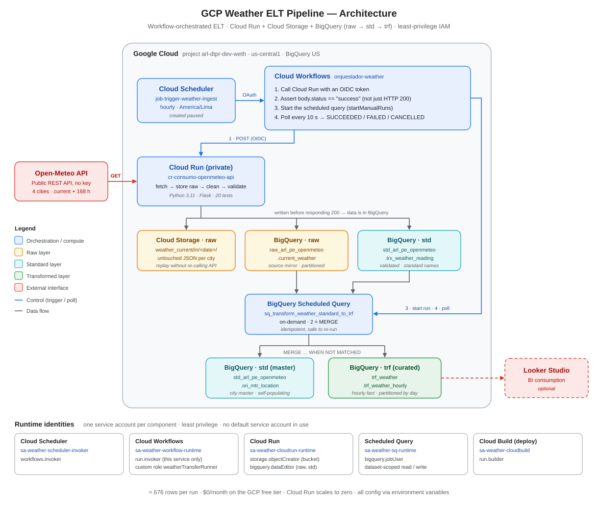
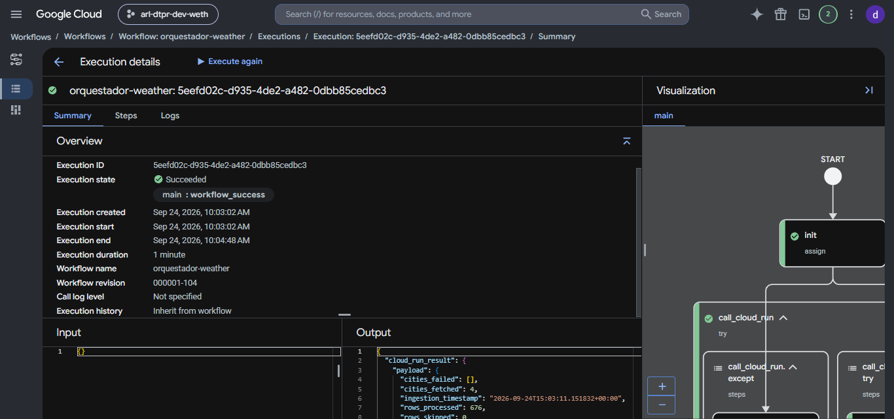
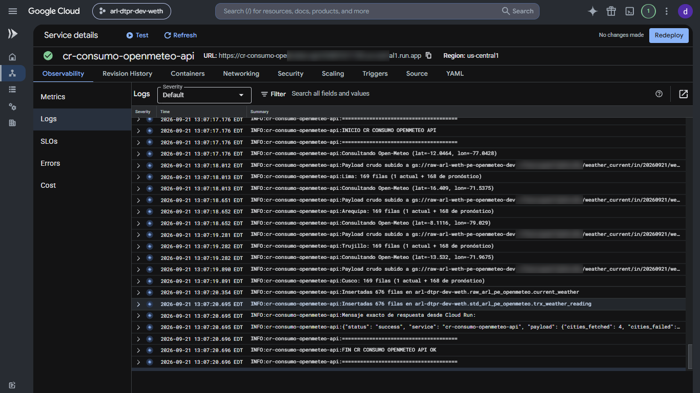
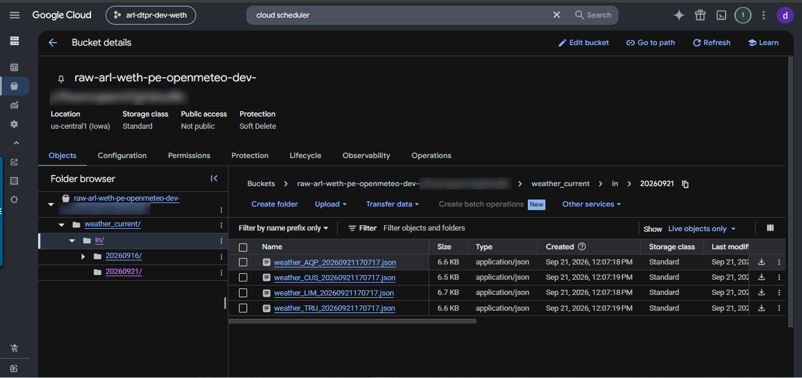
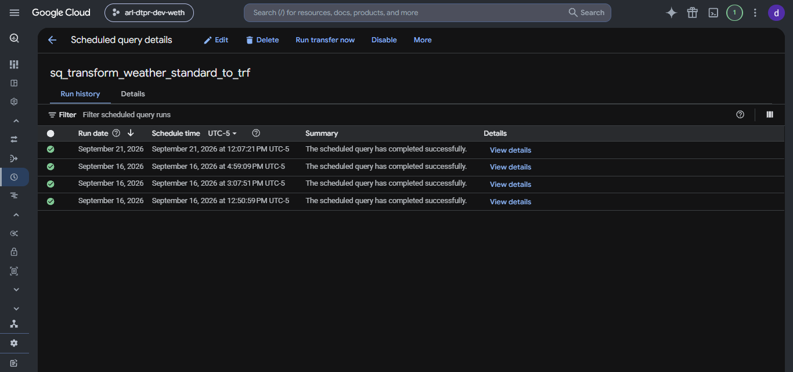
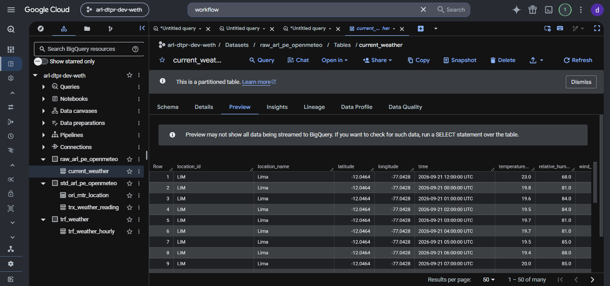
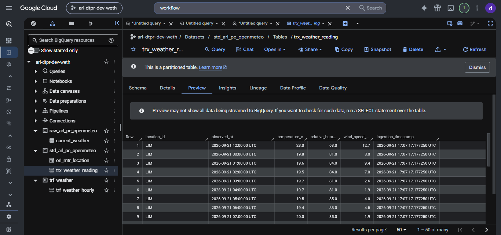
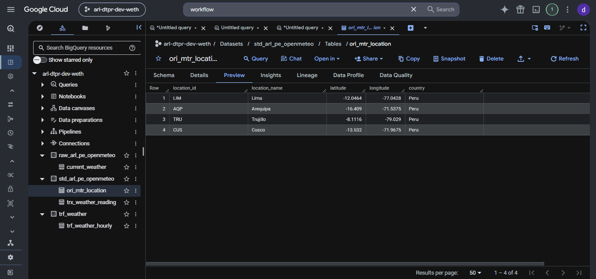
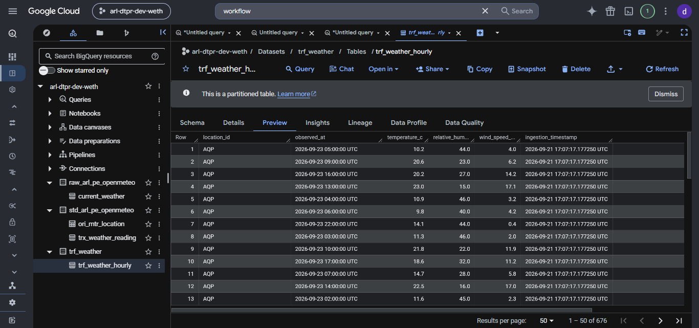
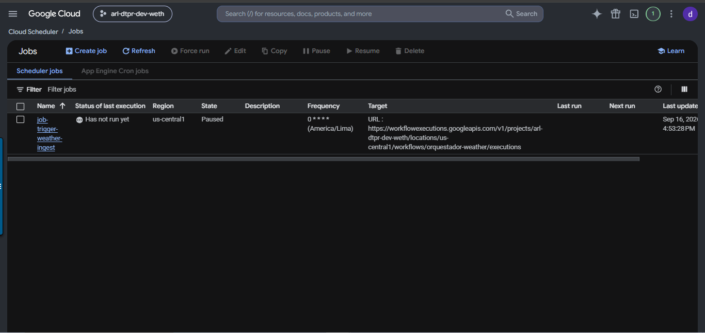

# GCP Weather ELT Pipeline


An end-to-end ELT pipeline on Google Cloud that pulls weather data for four Peruvian cities from a public API and lands it in BigQuery across **raw → standard → transformed** layers. A **Cloud Workflow** orchestrates every run and checks that each step actually succeeded before moving on.

The whole pipeline runs on the GCP free tier, but it is built with the same patterns I use on client platforms: private services, one identity per component, idempotent loads, partitioned tables and configuration kept out of code.



---

## Highlights

- **Verified orchestration, not chained crons.** The Workflow calls Cloud Run, checks that the response body says `success` (an HTTP 200 alone is not enough), starts the BigQuery transformation and polls it until it reaches `SUCCEEDED`, `FAILED` or `CANCELLED`.
- **Private by default.** Cloud Run rejects unauthenticated calls and is invoked with an OIDC token. The raw bucket blocks public access.
- **Least-privilege IAM.** One service account per component (including the scheduled query and the Cloud Build deploys), a custom role (`weatherTransferRunner`) that only lets the Workflow start and read transfer runs, dataset-scoped BigQuery grants, and no component running as the default compute service account.
- **Layered data model.** Raw JSON in Cloud Storage for replay, a raw BigQuery mirror of the source, a validated standard layer, a city master table and a curated hourly fact table.
- **Idempotent transformations.** Both loads use `MERGE ... WHEN NOT MATCHED`, so a run can be repeated without duplicating rows.
- **Tested, layered service code.** The Cloud Run service is split into `api / core / integrations / services / utils` modules with 20 unit tests. Every setting comes from environment variables, and the service refuses to start if the target bucket is not set.

## How a run works

| Step | Component | What happens |
|---|---|---|
| 0 | Cloud Scheduler | Triggers the Workflow hourly (`America/Lima`). The job is created **paused**, and runs are started manually from the Workflow. |
| 1 | Cloud Workflows → Cloud Run | `POST` with an OIDC token to the private service. |
| 2 | Cloud Run | For each city, calls Open-Meteo (`current` + ~168 hourly forecast rows), uploads the untouched JSON to Cloud Storage, cleans and validates the records, and inserts them into the raw and standard tables **before** responding. |
| 3 | Cloud Workflows | Fails the run if `body.status != "success"`. |
| 4 | Cloud Workflows → BigQuery | Starts the on-demand scheduled query through the Data Transfer API (`startManualRuns`). |
| 5 | Scheduled Query | Two `MERGE` statements: new cities into the master table, new hourly readings into the curated fact table. |
| 6 | Cloud Workflows | Polls the transfer run every 10 s and returns both results. |

A successful run returns:

```json
{
  "cloud_run_result": {
    "status": "success",
    "service": "cr-consumo-openmeteo-api",
    "payload": { "cities_fetched": 4, "cities_failed": [], "rows_processed": 676, "rows_skipped": 0 }
  },
  "scheduled_query_final_state": "SUCCEEDED"
}
```

## Data model

| Layer | Object | Grain | Notes |
|---|---|---|---|
| Raw (files) | `gs://raw-…/weather_current/in/<YYYYMMDD>/weather_<CITY>_<timestamp>.json` | One API response per city per run | Source of truth, so data can be reprocessed without calling the API again |
| Raw | `raw_arl_pe_openmeteo.current_weather` | One row per reading | Source field names, unvalidated. Partitioned by ingestion date, clustered by `location_id` |
| Standard | `std_arl_pe_openmeteo.trx_weather_reading` | One validated row per reading | Standardized names (`temperature_c`, `wind_speed_kmh`, …). Rows with null values or temperatures outside -90…60 °C are dropped and counted |
| Standard (master) | `std_arl_pe_openmeteo.ori_mtr_location` | One row per city | Populates itself from the scheduled query |
| Transformed | `trf_weather.trf_weather_hourly` | One row per city per hour | Curated fact table for BI. Partitioned by `DATE(observed_at)`, clustered by `location_id` |

Naming follows a project taxonomy: `<bu>-<capability>-<env>-<domain>` for the project (`arl-dtpr-dev-weth`) and `raw_ / std_ / trf_` prefixes for datasets.

## Security & IAM

| Service account | Used by | Grants |
|---|---|---|
| `sa-weather-scheduler-invoker` | Cloud Scheduler | `roles/workflows.invoker` |
| `sa-weather-workflow-runtime` | Cloud Workflows | `roles/run.invoker` on this service only, custom `weatherTransferRunner`, `roles/logging.logWriter` |
| `sa-weather-cloudrun-runtime` | Cloud Run | `roles/storage.objectCreator` on the raw bucket, `WRITER` on `raw_` and `std_` datasets only |
| `sa-weather-sq-runtime` | Scheduled Query | `roles/bigquery.jobUser`, `READER` on `raw_`, `WRITER` on `std_` and `trf_` |
| `sa-weather-cloudbuild` | Cloud Build (source deploys) | `roles/run.builder` |

- The default compute service account has **no project roles** (its inherited `roles/editor` was removed) and no component runs as it.
- Dataset-level access is granted with BigQuery DCL (`GRANT ... ON SCHEMA`), which avoids the allowlisting limitation of `bq add-iam-policy-binding`.
- Verified after the change: the scheduled query jobs run as `sa-weather-sq-runtime` (checked in `INFORMATION_SCHEMA.JOBS_BY_PROJECT`), the last build ran as `sa-weather-cloudbuild`, and a full Workflow run finished `SUCCEEDED` with 676 rows.

## Evidence

Screenshots from real runs in the `arl-dtpr-dev-weth` project (project number and bucket suffix blurred).

| | |
|---|---|
| **Workflow run: `Succeeded`**, 676 rows, scheduled query `SUCCEEDED` <br>  | **Cloud Run logs**: 4 cities × 169 rows, 676 rows inserted in raw and std <br>  |
| **Cloud Storage raw zone**: one untouched JSON per city per run <br>  | **Scheduled query history**: on-demand runs, all successful <br>  |
| **Raw layer**: `current_weather` <br>  | **Standard layer**: `trx_weather_reading` <br>  |
| **City master**: `ori_mtr_location` <br>  | **Curated fact**: `trf_weather_hourly` (676 rows) <br>  |
| **Cloud Scheduler**: hourly job, paused by design <br>  | |

## Repository structure

```
.
├── cloud-run/cr-consumo-openmeteo-api/     # Cloud Run service (Python 3.11, Flask, gunicorn)
│   ├── Dockerfile · pyproject.toml · requirements.txt
│   ├── src/app/
│   │   ├── main.py                         # Flask app + /health
│   │   ├── api/routes/weather.py           # HTTP route, maps errors to 502 / 500
│   │   ├── core/config.py                  # all settings from environment variables
│   │   ├── integrations/                   # open_meteo · storage · bigquery clients
│   │   ├── services/weather_service.py     # fetch → store raw → clean → validate → insert
│   │   └── utils/
│   └── tests/                              # 20 unit tests (pytest)
├── bigquery/                               # DDL: raw, std (reading + master) and trf tables
├── scheduled-query/                        # MERGE statements for the std → trf transformation
├── workflow/                               # orquestador-weather.yaml + env.yaml
├── docs/                                   # technical document + service account register (Spanish)
└── images/                                 # architecture diagram and run evidence
```

## Deploying it

The full step-by-step guide, with every `gcloud` / `bq` command, is in [`docs/technical-document-es.md`](docs/technical-document-es.md), and every service account with its exact grants is documented in [`docs/service-accounts-es.md`](docs/service-accounts-es.md) (both in Spanish). In short:

1. Enable the Run, Cloud Build, Artifact Registry, Scheduler, BigQuery, Data Transfer, Storage, Workflows and IAM APIs.
2. Create the service accounts and the custom role.
3. Create the bucket, the three datasets and the four tables.
4. Run the tests and deploy Cloud Run with `--no-allow-unauthenticated`, then grant `run.invoker` to the Workflow identity.
5. Create the on-demand scheduled query and note its `transferConfigId`.
6. Create the Workflow with its environment variables and run it with **Execute**.
7. Create the Cloud Scheduler job (paused).

Run the tests locally:

```bash
cd cloud-run/cr-consumo-openmeteo-api
pip install -r requirements.txt pytest
GCS_BUCKET_NAME=test-bucket pytest tests/ -v
```

## Cost

Everything stays inside the permanent GCP free tier: about 676 rows and 4 small JSON files per run, one Cloud Run request (the service scales to zero), and ~20 Workflow steps. Cloud Build and Artifact Registry are used only on deploy.

## Lessons learned

| Symptom | Root cause | Fix |
|---|---|---|
| `403 insufficient_scope` from the Workflow | A trailing `/` in the Cloud Run URL, so the OIDC audience did not match the service URL | Build the URL without a trailing slash |
| `403` right after granting `run.invoker` | IAM propagation delay (1–2 min) | Wait and retry |
| `Workflows service agent does not exist` | API enabled seconds earlier | `gcloud beta services identity create --service=workflows.googleapis.com` |
| `This feature requires allowlisting` on `bq add-iam-policy-binding` | CLI limitation for dataset-level bindings | Grant dataset access with BigQuery DCL: `GRANT ... ON SCHEMA` |
| Scheduled query started running every hour on its own | Changing its service account from the console **Edit** panel also saved the panel's schedule section (`Repeat frequency = Hours`) | Set **Repeat frequency** back to **On-demand**; always review it before saving that panel |
| `bq show --transfer_config` still showed the old owner after switching the service account | `ownerInfo` does not reflect the runtime identity | Verify with `user_email` in `INFORMATION_SCHEMA.JOBS_BY_PROJECT` |
| `observed_at` shifted by 5 hours (Arequipa's daily peak showing at 13:00 "UTC") | With `timezone=auto`, Open-Meteo returns each city's local time without an offset, and BigQuery stores an offset-less TIMESTAMP as UTC | Request `timezone=GMT`, covered by a unit test; truncate and reload |
| `FAILED_PRECONDITION` when forcing the Scheduler job | The job is paused by design | Trigger the Workflow directly with **Execute** |

## Roadmap

- [x] Dedicated service accounts for the scheduled query and Cloud Build; remove `roles/editor` from the default compute SA
- [x] Dataset-scoped BigQuery grants via `GRANT ... ON SCHEMA`
- [ ] Separate forecast rows from actual readings (`is_forecast` flag) and let newer forecasts update the curated table (`MERGE ... WHEN MATCHED`)
- [ ] Infrastructure as code (Terraform) for the full stack
- [ ] CI with GitHub Actions: tests and linting on every push
- [ ] Looker Studio dashboard on top of `trf_weather_hourly`

## Author

**Alvaro Yalle**, Senior Data Engineer (GCP · Azure · AWS)
[GitHub](https://github.com/ayalle2024) · [LinkedIn](https://www.linkedin.com/in/alvaro-luis-yalle-yalli-425b2162) · [Upwork](https://www.upwork.com/freelancers/~01d7539a2f4ec94842) · ayalle@arla-asociados.com
